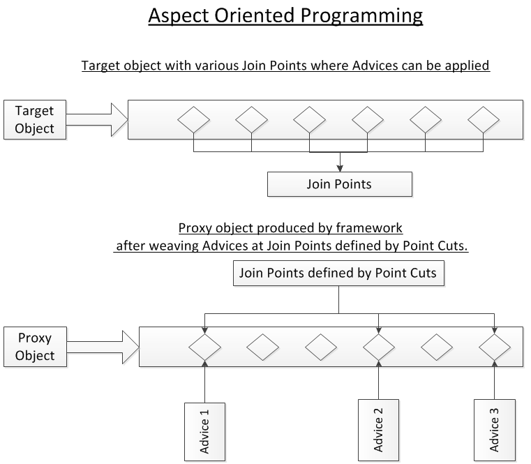

# Aspect

This is a module which has a set of APIs providing cross-cutting requirements.

# Join point 

*it is the actual place in the application where an action will be taken using Spring AOP framework*, This represents a point in your application where you can plug-in the AOP aspect. You can also say,

# Pointcut 

*This is a set of one or more join points where an advice should be executed*. You can specify pointcuts using expressions or patterns as we will see in our AOP examples.

# Advice 

*This is the actual action to be taken* either before or after the method execution. This is an actual piece of code that is invoked during the program execution by Spring AOP framework.

# Introduction 

allows you to introduce *new interfaces (and a corresponding implementation) to any advised object*.

# Target Object

Target Object is the Object on which an Aspect applies the Advice. We can also call it Advised Object.

# AOP Proxy

For each of the target objects, Spring AOP creates proxy classes. Thus, when we auto-wire a Target Object, Spring injects the proxy for that Object.

# Weaving

Weaving is the *process of linking aspects with other application types or objects* to create an advised object. This can be done at compile time, load time, or at runtime.
